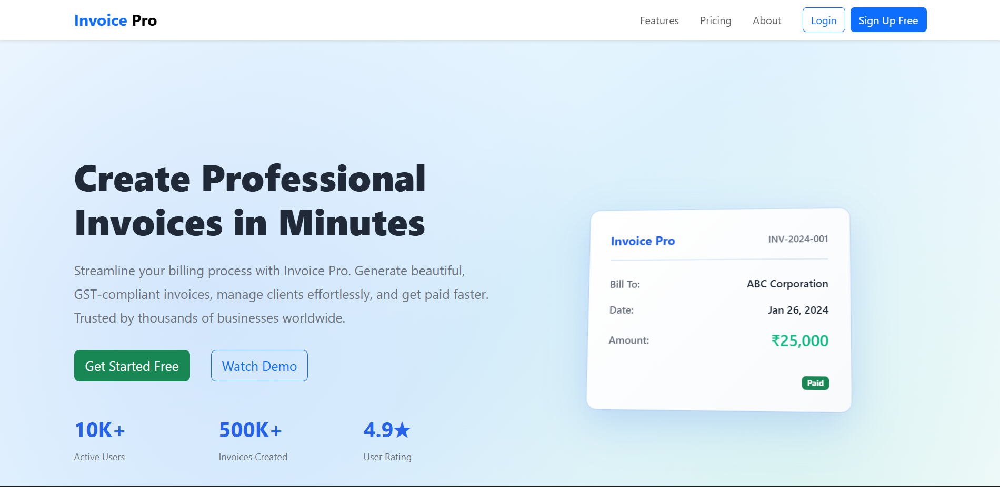
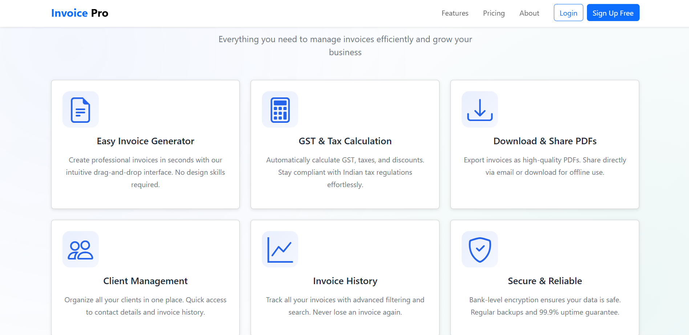
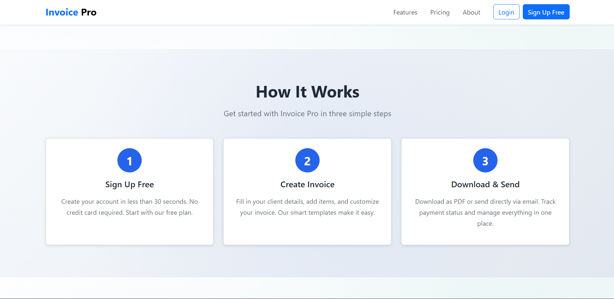
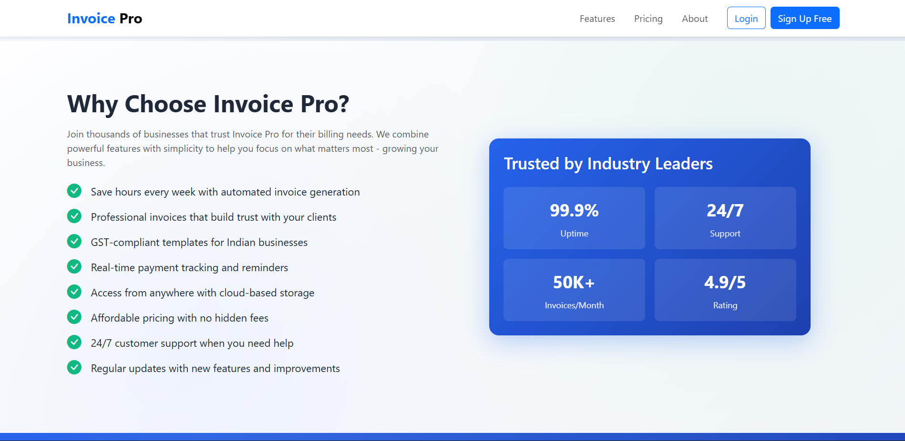
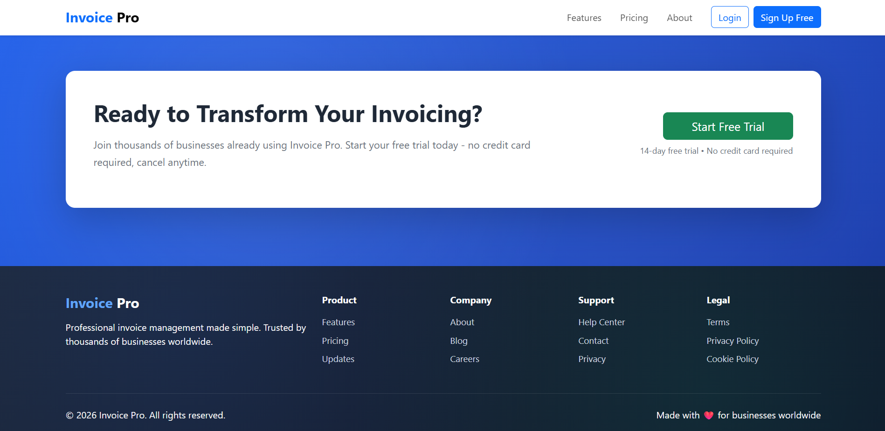

# Invoice Pro 💼

A professional invoice management SaaS application built with the MERN stack. Create beautiful, GST-compliant invoices in minutes with a modern, responsive landing page.


## 📸 Screenshots

### Hero Section

*Professional hero section with compelling CTA and invoice preview card*

### Features Section

*Showcase of 6 powerful features with professional icons*

### How It Works

*Simple 3-step process to get started*

### Why Choose Invoice Pro

*Benefits and trust indicators*

### Call to Action

*Compelling call-to-action to drive conversions*

### Full Landing Page

*Complete responsive landing page view*

## 🚀 Features

### Landing Page Sections
- ✅ **Professional Navbar** - Fixed navigation with smooth scrolling
- ✅ **Hero Section** - Compelling headline with invoice preview card
- ✅ **Features Showcase** - 6 feature cards with professional Bootstrap icons
- ✅ **How It Works** - 3-step process visualization
- ✅ **Why Choose Invoice Pro** - Benefits list with trust indicators
- ✅ **Call to Action** - Highlighted signup section
- ✅ **Footer** - Comprehensive links and information

### Design Highlights
- 🎨 Modern SaaS design inspired by Stripe/Zoho/FreshBooks
- 🌈 Beautiful gradient backgrounds throughout
- ✨ Smooth hover effects and animations
- 📱 Fully responsive design (mobile, tablet, desktop)
- 🎯 Professional Bootstrap Icons (no emojis)
- 🔒 Trust-building color scheme (blue + green)
- 💫 Glassmorphism effects on navbar
- 🎭 3D invoice preview card with hover animations

## 🛠️ Tech Stack

- **Frontend**: React 18 + Vite
- **Backend**: Node.js + Express
- **Styling**: Bootstrap 5 + Custom CSS with gradients
- **Icons**: Bootstrap Icons
- **Package Manager**: npm

## 📁 Project Structure

```
invoice-pro/
├── client/              # React frontend application
│   ├── src/
│   │   ├── components/  # React components
│   │   ├── styles/      # CSS files
│   │   ├── App.js       # Main app component
│   │   └── main.js      # Entry point
│   ├── index.html
│   ├── vite.config.js
│   └── package.json
├── server/              # Express backend server
│   ├── index.js         # Server entry point
│   ├── .env.example
│   └── package.json
├── screenshots/         # Project screenshots
├── package.json         # Root package.json
├── .gitignore
└── README.md
```

## 🚦 Getting Started

### Prerequisites

- Node.js (v16 or higher)
- npm (v8 or higher)

### Installation

1. **Clone the repository**
   ```bash
   git clone https://github.com/yourusername/invoice-pro.git
   cd invoice-pro
   ```

2. **Install all dependencies** (root, client, and server):
   ```bash
   npm run install-all
   ```

   Or install manually:
   ```bash
   npm install
   cd client && npm install && cd ..
   cd server && npm install && cd ..
   ```

3. **Set up environment variables** (optional):
   ```bash
   cd server
   cp .env.example .env
   # Edit .env with your configuration
   ```

### Running the Application

#### Run Both Client and Server Together
```bash
npm run dev
```

This will start:
- **Server**: http://localhost:5000
- **Client**: http://localhost:5173

#### Run Client Only
```bash
npm run client
```

#### Run Server Only
```bash
npm run server
```

## 📜 Available Scripts

### Root Level
- `npm run dev` - Runs both client and server concurrently
- `npm run client` - Runs only the React client
- `npm run server` - Runs only the Express server
- `npm run install-all` - Installs dependencies for root, client, and server

### Client Scripts (in `client/` folder)
- `npm run dev` - Start Vite dev server
- `npm run build` - Build for production
- `npm run preview` - Preview production build

### Server Scripts (in `server/` folder)
- `npm run dev` - Start Express server
- `npm start` - Start Express server (production)

## 🎯 Current Status

### ✅ Completed
- Professional landing page with all sections
- Responsive design for all screen sizes
- Gradient backgrounds and modern styling
- Bootstrap Icons integration
- Smooth animations and hover effects
- Express backend placeholder

### 🚧 In Progress / Planned
- [ ] User authentication (JWT)
- [ ] Invoice CRUD operations
- [ ] PDF generation
- [ ] Client management
- [ ] MongoDB database integration
- [ ] Payment tracking
- [ ] Dashboard implementation
- [ ] Invoice templates

## 🔧 Backend

The backend is currently a placeholder with:
- Basic Express server setup
- CORS enabled
- Health check endpoint: `/api/health`
- API endpoint: `/api`

Ready for full API development.

## 💻 Frontend

The frontend is a complete landing page built with:
- React 18 with functional components
- Bootstrap 5 for responsive layout
- Custom CSS with gradient backgrounds
- Bootstrap Icons for professional iconography
- Semantic HTML for accessibility
- Smooth scroll navigation

## 🎨 Design Philosophy

- **Professional**: Clean, modern design suitable for B2B SaaS
- **Trustworthy**: Blue and green color scheme builds confidence
- **Accessible**: High contrast ratios and semantic HTML
- **Responsive**: Works seamlessly on all devices
- **Performant**: Optimized assets and efficient rendering

## 📝 Development Notes

- Login and Sign Up buttons are UI-only (no backend integration yet)
- All navigation links use anchor tags for smooth scrolling
- The project is ready for backend API integration
- Components are modular and reusable
- All styling uses CSS custom properties for easy theming

## 🤝 Contributing

Contributions are welcome! Please feel free to submit a Pull Request.

1. Fork the project
2. Create your feature branch (`git checkout -b feature/AmazingFeature`)
3. Commit your changes (`git commit -m 'Add some AmazingFeature'`)
4. Push to the branch (`git push origin feature/AmazingFeature`)
5. Open a Pull Request

## 📄 License

This project is licensed under the ISC License.

## 👤 Author

**Your Name**
- GitHub: [@yourusername](https://github.com/yourusername)
- Email: your.email@example.com

## 🙏 Acknowledgments

- Design inspiration from Stripe, Zoho, and FreshBooks
- Bootstrap team for the amazing framework and icons
- React and Vite communities

---

⭐ If you like this project, please give it a star on GitHub!
